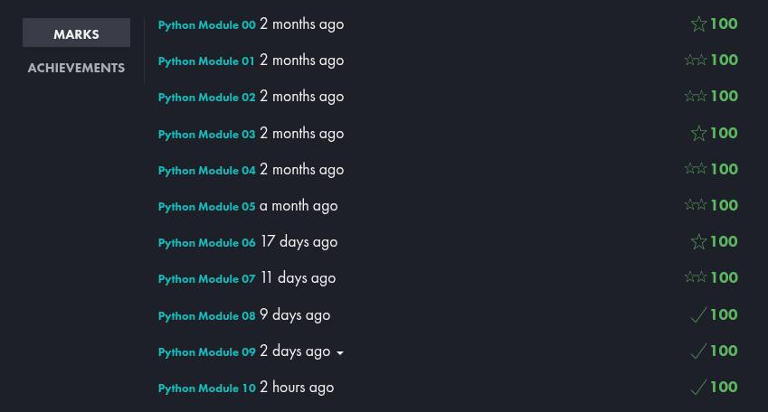

<div>

```
██████╗ ██╗   ██╗████████╗██╗  ██╗ ██████╗ ███╗   ██╗
██╔══██╗╚██╗ ██╔╝╚══██╔══╝██║  ██║██╔═══██╗████╗  ██║
██████╔╝ ╚████╔╝    ██║   ███████║██║   ██║██╔██╗ ██║
██╔═══╝   ╚██╔╝     ██║   ██╔══██║██║   ██║██║╚██╗██║
██║        ██║      ██║   ██║  ██║╚██████╔╝██║ ╚████║
╚═╝        ╚═╝      ╚═╝   ╚═╝  ╚═╝ ╚═════╝ ╚═╝  ╚═══╝

███╗   ███╗ ██████╗ ██████╗ ██╗   ██╗██╗     ███████╗███████╗
████╗ ████║██╔═══██╗██╔══██╗██║   ██║██║     ██╔════╝██╔════╝
██╔████╔██║██║   ██║██║  ██║██║   ██║██║     █████╗  ███████╗
██║╚██╔╝██║██║   ██║██║  ██║██║   ██║██║     ██╔══╝  ╚════██║
██║ ╚═╝ ██║╚██████╔╝██████╔╝╚██████╔╝███████╗███████╗███████╗
╚═╝     ╚═╝ ╚═════╝ ╚═════╝  ╚═════╝ ╚══════╝╚══════╝╚══════╝

```
</div>

<div align="center">

[](https://www.python.org/)
[](https://42.fr/)
[](https://flake8.pycqa.org/)
[](.)
[](.)

</div>

## ✅ Project grade screenshot



---

# 🐍 42 Python Cursus — Complete Module Reference

> **A comprehensive overview of all modules in the 42 Network Python curriculum**
> *From fundamentals to functional programming mastery*

---

## 📖 About This Cursus

The **42 Python Cursus** is a progressive, project-driven curriculum that takes you from zero Python knowledge to enterprise-level software architecture. Each module builds directly on the one before it, using immersive thematic contexts — gardens, cyber-archives, game engines, space stations — to make abstract programming concepts concrete and memorable.

**Core principles across all modules:**
- Every program must run without crashes — all errors must be handled gracefully
- All code must pass `flake8` linting standards
- Docstrings are required for all classes and functions
- You submit only what you fully understand — peer evaluation will test your comprehension live

---

## 🗺️ Curriculum Map

| # | Module | Theme | Core Topic |
|---|--------|-------|------------|
| 00 | [Growing Code](#-module-00--growing-code) | Community Garden | Python Fundamentals |
| 01 | [CodeCultivation](#-module-01--codecultivation) | Garden Ecosystem | Object-Oriented Programming |
| 02 | [Garden Guardian](#-module-02--garden-guardian) | Smart Agriculture | Exception Handling |
| 03 | [Data Quest](#-module-03--data-quest) | Game Analytics | Collections & Data Structures |
| 04 | [Data Archivist](#-module-04--data-archivist) | Cyber Archives 2087 | File I/O & Streams |
| 05 | [Code Nexus](#-module-05--code-nexus) | Neo-Tokyo 2087 | Polymorphism & ABCs |
| 06 | [The Codex](#-module-06--the-codex) | Alchemical Laboratory | Python Import System |
| 07 | [DataDeck](#-module-07--datadeck) | Trading Card Game | Advanced OOP & Design Patterns |
| 08 | [The Matrix](#-module-08--the-matrix) | Digital Matrix | Virtual Environments & Tooling |
| 09 | [DataMatrix](#-module-09--datamatrix) | Cosmic Observatory | Data Validation with Pydantic |
| 10 | [FuncMage](#-module-10--funcmage) | Mage Chronicles | Functional Programming |

---

## 🌱 Module 00 — Growing Code

> **Python Fundamentals Through Garden Data**

**Theme:** Community garden management system
**Exercises:** 8 (ex0–ex7)

### What You Learn
The absolute foundation of Python: expressions, variables, arithmetic, user input, conditionals, loops, recursion, string formatting, and type annotations. Every concept is introduced once, in isolation, through a self-contained function.

### Exercises at a Glance

| Exercise | File | Concept |
|----------|------|---------|
| Ex00 — Hello Garden | `ft_hello_garden.py` | First function, `print()` |
| Ex01 — Garden Plot Area | `ft_plot_area.py` | Variables, arithmetic, `input()` |
| Ex02 — Harvest Total | `ft_harvest_total.py` | Multiple inputs, addition |
| Ex03 — Plant Age Check | `ft_plant_age.py` | `if/else` conditionals |
| Ex04 — Water Reminder | `ft_water_reminder.py` | Conditionals with comparison |
| Ex05 — Count to Harvest | `ft_count_harvest_iterative.py` / `ft_count_harvest_recursive.py` | Loops & recursion |
| Ex06 — Garden Summary | `ft_garden_summary.py` | String formatting, multiple data types |
| Ex07 — Seed Inventory | `ft_seed_inventory.py` | Type annotations, `match`/conditional logic |

### Key Rules
- Write **only** the function — no `if __name__ == "__main__":` blocks
- Function names must match exactly as specified
- Type hints are optional for ex00–ex06, **required** for ex07

### Technical Requirements
- Python 3.10+, flake8 compliant
- Authorized built-ins per exercise: `print()`, `input()`, `int()`, `range()`

### Project Structure
```
module00/
├── ex0/ft_hello_garden.py
├── ex1/ft_plot_area.py
├── ex2/ft_harvest_total.py
├── ex3/ft_plant_age.py
├── ex4/ft_water_reminder.py
├── ex5/ft_count_harvest_iterative.py
├── ex5/ft_count_harvest_recursive.py
├── ex6/ft_garden_summary.py
└── ex7/ft_seed_inventory.py
```

---

## 🌿 Module 01 — CodeCultivation

> **Object-Oriented Garden Systems**

**Theme:** Digital garden ecosystem design
**Exercises:** 7 (ex0–ex6)

### What You Learn
OOP from scratch: program entry points, class design, instance methods, constructor patterns, encapsulation with getters/setters, inheritance chains, and advanced class mechanics (`@classmethod`, `@staticmethod`, nested classes).

### Exercises at a Glance

| Exercise | File | Key Concept |
|----------|------|-------------|
| Ex00 — Planting Your First Seed | `ft_garden_intro.py` | `__name__ == "__main__"`, variables |
| Ex01 — Garden Data Organizer | `ft_garden_data.py` | `class`, `__init__`, object instantiation |
| Ex02 — Plant Growth Simulator | `ft_plant_growth.py` | Instance methods, object state |
| Ex03 — Plant Factory | `ft_plant_factory.py` | Constructor patterns, object creation at scale |
| Ex04 — Garden Security System | `ft_garden_security.py` | Encapsulation, getters/setters, validation |
| Ex05 — Specialized Plant Types | `ft_plant_types.py` | Inheritance, `super().__init__()`, polymorphism |
| Ex06 — Garden Analytics Platform | `ft_garden_analytics.py` | Nested classes, `@classmethod`, `@staticmethod` |

### Class Hierarchy (Ex05–Ex06)
```
Plant
├── Flower          → color, bloom()
├── Tree            → trunk_diameter, produce_shade()
└── Vegetable       → harvest_season, nutritional_value

Plant → FloweringPlant → PrizeFlower
GardenManager
└── GardenStats     (nested helper class)
```

### Concepts Introduced

| Concept | First Seen |
|---------|------------|
| `if __name__ == "__main__":` | Ex00 |
| `class` & `__init__` | Ex01 |
| Instance methods | Ex02 |
| Constructor patterns | Ex03 |
| Encapsulation / getters & setters | Ex04 |
| Inheritance & `super()` | Ex05 |
| Nested classes, `@classmethod`, `@staticmethod` | Ex06 |

### Key Rules
- Class names in **PascalCase**, functions/variables in **snake_case**
- Docstrings required for all classes and methods
- Programs must always run without errors

---

## 🛡️ Module 02 — Garden Guardian

> **Data Engineering for Smart Agriculture**

**Theme:** Smart agricultural monitoring system
**Exercises:** 6 (ex0–ex5)

### What You Learn
Exception handling — the skills that separate hobby scripts from production-grade systems. You learn how Python signals problems, how to catch and recover gracefully, how to define your own error types, and how to guarantee cleanup with `finally`.

### Exercises at a Glance

| Exercise | File | Key Concept |
|----------|------|-------------|
| Ex00 — Agricultural Data Validation Pipeline | `ft_first_exception.py` | `try/except`, basic exception catching |
| Ex01 — Different Types of Problems | `ft_different_errors.py` | Built-in exception types, multi-except |
| Ex02 — Making Your Own Error Types | `ft_custom_errors.py` | Custom exceptions, exception inheritance |
| Ex03 — Finally Block | `ft_finally_block.py` | `try/except/finally`, resource cleanup |
| Ex04 — Raising Your Own Errors | `ft_raise_errors.py` | `raise`, input validation |
| Ex05 — Garden Management System | `ft_garden_management.py` | Full integration of all techniques |

### Custom Exception Hierarchy (Ex02+)
```
Exception
└── GardenError          ← base for all garden problems
    ├── PlantError       ← individual plant issues
    └── WaterError       ← watering system issues
```

### Full Exception Hierarchy Reference
```
BaseException
└── Exception
    ├── ValueError
    ├── ZeroDivisionError
    ├── FileNotFoundError
    ├── KeyError
    └── GardenError
        ├── PlantError
        └── WaterError
```

### Key Rules
- Programs must **never crash** — every possible exception must be caught
- Show both success paths **and** error paths in every exercise
- Do not use bare `except Exception` — be specific about exception types
- Use the most specific exception type available for each situation

---

## 🎮 Module 03 — Data Quest

> **Mastering Python Collections for Data Engineering**

**Theme:** PixelMetrics 3000 game analytics platform
**Exercises:** 7 (ex0–ex6, called Lv.0–Lv.6)

### What You Learn
Python's core data structures — lists, tuples, sets, dictionaries, generators, and comprehensions — plus command-line argument handling via `sys.argv`. Each level unlocks a new data superpower.

### Exercises at a Glance

| Level | Exercise | File | Data Structure |
|-------|----------|------|----------------|
| Lv.0 | Command Quest | `ft_command_quest.py` | `sys.argv`, command-line arguments |
| Lv.1 | Score Cruncher | `ft_score_analytics.py` | **Lists** — sequential data, statistics |
| Lv.2 | Position Tracker | `ft_coordinate_system.py` | **Tuples** — immutable 3D coordinates |
| Lv.3 | Achievement Hunter | `ft_achievement_tracker.py` | **Sets** — unique collections, set algebra |
| Lv.4 | Inventory Master | `ft_inventory_system.py` | **Dictionaries** — key-value lookups, nesting |
| Lv.5 | Stream Wizard | `ft_data_stream.py` | **Generators** — memory-efficient streaming |
| Lv.6 | Data Alchemist | `ft_analytics_dashboard.py` | **Comprehensions** — list, dict, set |

### Collection Quick Reference

| Collection | Syntax | Ordered | Mutable | Duplicates | Best For |
|------------|--------|---------|---------|------------|----------|
| `list` | `[a, b, c]` | ✅ | ✅ | ✅ | Sequential data, scores |
| `tuple` | `(a, b, c)` | ✅ | ❌ | ✅ | Fixed data, coordinates |
| `set` | `{a, b, c}` | ❌ | ✅ | ❌ | Unique values, set algebra |
| `dict` | `{k: v}` | ✅ (3.7+) | ✅ | Keys: ❌ | Lookups, mappings, records |
| `generator` | `yield` | ✅ (lazy) | ❌ | ✅ | Large/infinite data streams |

### Key Rules
- Only `sys` may be imported — no `json`, `csv`, `os`, `random`, or third-party libs
- No file I/O — all data must be in-memory or via `sys.argv`
- Be ready to justify every data structure choice during evaluation

---

## 🗄️ Module 04 — Data Archivist

> **Digital Preservation in the Cyber Archives**

**Theme:** Data Preservation Division in the year 2087
**Exercises:** 5 (ex0–ex4, called Missions 0–4)

### What You Learn
File I/O, stream management, context managers, and combined error handling — the skills that turn a programmer into a true data engineer. You learn to read and write files safely, separate `stdout` from `stderr`, and use `with` statements for guaranteed resource cleanup.

### Exercises at a Glance

| Mission | Exercise | File | Core Concept |
|---------|----------|------|--------------|
| Mission 0 | Ancient Text Recovery | `ft_ancient_text.py` | Reading files with `open()` / `read()` |
| Mission 1 | Archive Creation | `ft_archive_creation.py` | Writing files with `open('w')` / `write()` |
| Mission 2 | Stream Management | `ft_stream_management.py` | `stdin`, `stdout`, `stderr` |
| Mission 3 | Vault Security | `ft_vault_security.py` | Context managers — the `with` statement |
| Mission 4 | Crisis Response | `ft_crisis_response.py` | `try/except` + `with` — full error handling |

### File Mode Reference

| Mode | Behavior |
|------|----------|
| `'r'` | Read — opens existing file; fails if missing |
| `'w'` | Write — creates new or **completely replaces** existing |
| `'a'` | Append — creates new or appends without truncating |
| `'r+'` | Read + Write — opens existing for both |

### Stream Reference

| Stream | Default Target | Use Case |
|--------|----------------|----------|
| `sys.stdout` | Terminal | Normal program output |
| `sys.stderr` | Terminal (separate) | Errors, warnings, diagnostics |
| `sys.stdin` | Keyboard | Reading user input |

### Key Rules
- Always use `with` when opening files in Ex03 and Ex04
- Never import anything except `sys`
- The `with` statement implements RAII — resources are released automatically on scope exit

---

## 🔌 Module 05 — Code Nexus

> **Polymorphic Data Streams in the Digital Matrix**

**Theme:** Stream Engineers in Neo-Tokyo 2087
**Exercises:** 3 (ex0–ex2, called Phases Alpha–Gamma)

### What You Learn
Method overriding, subtype polymorphism, abstract base classes (ABC), and Protocol-based duck typing — the skills that elevate a programmer into a true system architect. You design flexible class hierarchies that handle completely different data types through a single unified interface.

### Exercises at a Glance

| Phase | Exercise | File | Core Concept |
|-------|----------|------|--------------|
| Alpha | Data Processor Foundation | `stream_processor.py` | ABC + `@abstractmethod` + method overriding |
| Beta | Polymorphic Streams | `data_stream.py` | Subtype polymorphism + batch processing |
| Gamma | Nexus Integration | `nexus_pipeline.py` | Pipeline architecture + Protocol (duck typing) |

### Class Hierarchies

**Phase Alpha:**
```
DataProcessor (ABC)
├── NumericProcessor
├── TextProcessor
└── LogProcessor
```

**Phase Beta:**
```
DataStream (ABC)
├── SensorStream
├── TransactionStream
└── EventStream
```

**Phase Gamma:**
```
ProcessingStage (Protocol — no inheritance required)
ProcessingPipeline (ABC)
├── JSONAdapter
├── CSVAdapter
└── StreamAdapter
```

### ABC vs Protocol Reference

| Feature | `ABC` + `@abstractmethod` | `Protocol` |
|---------|--------------------------|------------|
| Inheritance required | ✅ Yes | ❌ No |
| Enforcement | At instantiation time | At type-check time |
| Use case | Shared base behavior + forced interface | Pure structural/duck typing |

### Key Rules
- All base classes must use `ABC` and `@abstractmethod`
- Type annotations mandatory for all parameters, return types, and attributes
- Use `typing` module: `Any`, `List`, `Dict`, `Union`, `Optional`, `Protocol`

---

## 📜 Module 06 — The Codex

> **Mastering Python's Import Mysteries**

**Theme:** Alchemical Laboratory — code organization as ancient magic
**Exercises:** 4 (called Mysteries I–IV)

### What You Learn
Python's import system — package initialization, import styles, absolute vs relative imports, and resolving circular dependencies. You learn to turn directories into packages, control what each package exposes, and navigate module boundaries safely.

### Exercises at a Glance

| Mystery | Part | Demo Script | Core Concept |
|---------|------|-------------|--------------|
| I | The Sacred Scroll | `ft_sacred_scroll.py` | `__init__.py` — package interface control |
| II | Import Transmutation | `ft_import_transmutation.py` | `import`, `from...import`, `as` — four styles |
| III | The Great Pathway Debate | `ft_pathway_debate.py` | Absolute vs relative imports |
| IV | Breaking the Circular Curse | `ft_circular_curse.py` | Late imports — circular dependency resolution |

### Package Structure
```
module06/
├── ft_sacred_scroll.py
├── ft_import_transmutation.py
├── ft_pathway_debate.py
├── ft_circular_curse.py
└── alchemy/
    ├── __init__.py
    ├── elements.py
    ├── potions.py
    ├── transmutation/
    │   ├── __init__.py
    │   ├── basic.py         ← absolute imports
    │   └── advanced.py      ← relative imports
    └── grimoire/
        ├── __init__.py
        ├── spellbook.py     ← late import pattern
        └── validator.py
```

### Import Style Reference

```python
# Style 1 — Full module import
import alchemy.elements
alchemy.elements.create_fire()

# Style 2 — Specific function import
from alchemy.elements import create_fire
create_fire()

# Style 3 — Aliased import
from alchemy.potions import healing_potion as heal
heal()

# Style 4 — Multiple specific imports
from alchemy.elements import create_fire, create_earth
```

### Late Import Pattern (Breaking Circular Dependencies)

```python
# Top-level import — dangerous if there is a cycle
from .validator import validate_ingredients   # runs at module load time

# Late import — safe, deferred to call time
def record_spell(spell_name: str, ingredients: str) -> str:
    from .validator import validate_ingredients   # inside the function body
    ...
```

### Key Rules
- Every package directory must have `__init__.py`
- Never use `eval()`, `exec()`, or modify `sys.path`
- Run all demo scripts from the project root, not from inside subdirectories

---

## 🃏 Module 07 — DataDeck

> **Master the Art of Abstract Programming Patterns**

**Theme:** Trading Card Game Engine (Magic: The Gathering / Hearthstone style)
**Exercises:** 5 (ex0–ex4)

### What You Learn
Enterprise-level OOP through a layered architecture: abstract base classes as contracts, multiple inheritance for interface composition, and two classic design patterns — Abstract Factory and Strategy. You are no longer just writing classes; you are designing extensible systems.

### Exercises at a Glance

| Exercise | Layer | What You Build |
|----------|-------|----------------|
| Ex00 — Card Foundation | Foundation | `Card` ABC + `CreatureCard`; abstract methods, validation |
| Ex01 — Deck Builder | Implementation | `SpellCard`, `ArtifactCard` + polymorphic `Deck` manager |
| Ex02 — Ability System | Ability Layer | `Combatable` + `Magical` interfaces; `EliteCard` via multiple inheritance |
| Ex03 — Game Engine | Engine | Strategy Pattern (`AggressiveStrategy`) + Abstract Factory (`FantasyCardFactory`) |
| Ex04 — Tournament Platform | Platform | `Rankable` interface, `TournamentCard`, `TournamentPlatform`, leaderboards |

### Architecture
```
          ┌────────────────────┐
          │   Tournament Layer │
          └─────────┬──────────┘
                    │
          ┌─────────▼──────────┐
          │     Game Engine     │
          └─────────┬──────────┘
                    │
          ┌─────────▼──────────┐
          │   Ability System    │
          └─────────┬──────────┘
                    │
          ┌─────────▼──────────┐
          │ Implementation Layer│
          └─────────┬──────────┘
                    │
          ┌─────────▼──────────┐
          │   Foundation Layer  │
          └────────────────────┘
```

### Design Patterns Used

| Pattern | Where |
|---------|-------|
| Abstract Factory | Card creation |
| Strategy | Game behavior per turn |
| Interface Composition | Elite & Tournament cards |

### Running the Exercises
```bash
# Use absolute imports — run from repo root with -m
python3 -m ex0.main
python3 -m ex1.main
python3 -m ex2.main
python3 -m ex3.main
python3 -m ex4.main
```

---

## 🔴 Module 08 — The Matrix

> **Welcome to the Real World of Data Engineering**

**Theme:** The Matrix — building systems that survive the real world
**Exercises:** 3 (ex0–ex2)

### What You Learn
The operational foundation of real software projects: virtual environments, package management with pip and Poetry, and secure configuration via environment variables. Day-one skills for any data engineering role.

### Exercises at a Glance

| Exercise | File(s) | Core Concept |
|----------|---------|--------------|
| Ex00 — Entering the Matrix | `construct.py` | Detecting and creating virtual environments |
| Ex01 — Loading Programs | `loading.py`, `requirements.txt`, `pyproject.toml` | pip, Poetry, `pandas`, `numpy`, `matplotlib` |
| Ex02 — Accessing the Mainframe | `oracle.py`, `.env.example`, `.gitignore` | Environment variables with `python-dotenv` |

### Three Pillars

**Virtual Environments**
```python
def in_virtualenv() -> bool:
    return sys.prefix != sys.base_prefix
```

**Package Management**

| Tool | Config File | Install Command |
|------|-------------|-----------------|
| pip | `requirements.txt` | `pip install -r requirements.txt` |
| Poetry | `pyproject.toml` | `poetry install` |

**Environment Variables**
```
.env          ← local dev secrets (never commit this)
.env.example  ← template showing required keys (safe to commit)
.gitignore    ← ensures .env is excluded from version control
```

### Required Variables for Ex02

| Variable | Purpose |
|----------|---------|
| `MATRIX_MODE` | `development` or `production` |
| `DATABASE_URL` | Connection string |
| `API_KEY` | External service key |
| `LOG_LEVEL` | Logging verbosity |
| `ZION_ENDPOINT` | Resistance network URL |

### Key Rules
- Never commit a real `.env` file — only `.env.example` belongs in version control
- Secrets must never live in code — configuration is separate from code

---

## 🚀 Module 09 — DataMatrix

> **Master the Art of Data Validation**

**Theme:** Cosmic Data Observatory — space data validation system
**Exercises:** 3 (ex0–ex2) + 2 utility files

### What You Learn
Production-grade data validation using Pydantic — field constraints, Python Enums, cross-field validators, nested model composition, and graceful `ValidationError` handling. You design systems that reject bad data automatically at the boundary.

### Exercises at a Glance

| Exercise | File | What You Build |
|----------|------|----------------|
| Ex00 — Space Station | `space_station.py` | `SpaceStation` Pydantic model with field constraints |
| Ex01 — Alien Contact | `alien_contact.py` | `AlienContact` with Enum + `@model_validator` cross-field rules |
| Ex02 — Space Mission | `space_crew.py` | `CrewMember` + nested `SpaceMission` with composition rules |

### Key Pydantic Patterns

```python
# Field constraints
power_level: float = Field(..., ge=0.0, le=100.0)
crew_size: int     = Field(..., ge=1, le=20)

# Enums for strict value sets
class ContactType(str, Enum):
    radio      = "radio"
    visual     = "visual"
    physical   = "physical"
    telepathic = "telepathic"

# Cross-field validation
@model_validator(mode='after')
def validate_contact(self) -> 'AlienContact':
    if self.signal_strength > 7.0 and not self.message_received:
        raise ValueError("Strong signals should include a message")
    return self

# Nested models
class SpaceMission(BaseModel):
    crew: List[CrewMember]
```

### Architecture

```
Data Export Layer
      ↑
Data Generator Layer
      ↑
Nested Model Layer (SpaceMission)
      ↑
Cross-Field Logic (AlienContact)
      ↑
Foundation Layer (SpaceStation)
```

### Utility Files

| File | Purpose |
|------|---------|
| `data_generator.py` | Generate realistic test data for all models |
| `data_exporter.py` | Export data to `.json`, `.csv`, `.py` formats |

### Installation
```bash
pip install pydantic
```

---

## 🧙‍♂️ Module 10 — FuncMage

> **Master the Ancient Arts of Functional Programming**

**Theme:** FuncMage Chronicles — spell-casting engine
**Exercises:** 5 (ex0–ex4)

### What You Learn
Higher-order functions, closures, decorators, and the `functools` module — the arcane arts of functional design. You move from defining functions to composing them: functions that transform other functions, capture their environment, and enhance behavior transparently.

### Exercises at a Glance

| Exercise | File | Core Concept |
|----------|------|--------------|
| Ex00 — Lambda Sanctum | `lambda_spells.py` | `lambda`, `map()`, `filter()`, `sorted()` |
| Ex01 — Higher Realm | `higher_magic.py` | Functions that accept and return other callables |
| Ex02 — Memory Depths | `scope_mysteries.py` | Closures, `nonlocal`, lexical scoping |
| Ex03 — Ancient Library | `functools_artifacts.py` | `reduce`, `partial`, `lru_cache`, `singledispatch` |
| Ex04 — Master's Tower | `decorator_mastery.py` | Parameterized decorators, `@wraps`, `@staticmethod` |

### Architecture

```
Decorator Layer       (decorator_mastery.py)
      ↑
Functools Layer       (functools_artifacts.py)
      ↑
Closure Layer         (scope_mysteries.py)
      ↑
Higher-Order Layer    (higher_magic.py)
      ↑
Lambda Layer          (lambda_spells.py)
```

### Core Patterns

**Lambda expressions**
```python
sorted(artifacts, key=lambda a: a["power"], reverse=True)
list(filter(lambda m: m["power"] >= min_power, mages))
```

**Higher-order functions**
```python
def power_amplifier(base_spell: Callable, multiplier: int) -> Callable:
    def amplified(target: str, power: int) -> str:
        return base_spell(target, power * multiplier)
    return amplified
```

**Closures with `nonlocal`**
```python
def mage_counter() -> Callable:
    count = 0
    def counter() -> int:
        nonlocal count
        count += 1
        return count
    return counter
```

**Functools arsenal**
```python
functools.reduce(operator.add, spells)
functools.partial(enchant, power=50, element='fire')

@functools.lru_cache(maxsize=None)
def memoized_fibonacci(n): ...

@functools.singledispatch
def spell_dispatcher(spell): ...
```

**Parameterized decorators**
```python
def spell_timer(func: Callable) -> Callable:
    @wraps(func)
    def wrapper(*args, **kwargs):
        start = time.time()
        result = func(*args, **kwargs)
        print(f"Spell completed in {time.time() - start:.3f} seconds")
        return result
    return wrapper
```

### Functools Reference

| Function | Purpose |
|----------|---------|
| `functools.reduce` | Aggregate a sequence into a single value |
| `functools.partial` | Pre-fill arguments to create specialized callables |
| `functools.lru_cache` | Transparent memoization for pure functions |
| `functools.singledispatch` | Type-based function routing (no `isinstance` chains) |
| `functools.wraps` | Preserve `__name__`, `__doc__` in decorator wrappers |

### No external dependencies — stdlib only

---

## 🔧 Universal Technical Requirements

These requirements apply to **every module** in the cursus:

- **Language:** Python 3.10+
- **Linting:** All code must pass `flake8` standards
- **Crash policy:** Programs must never crash — all exceptions must be caught and handled
- **Naming:** Classes in `PascalCase`, functions and variables in `snake_case`
- **Documentation:** Docstrings required for all classes and methods (from Module 01 onward)
- **Type hints:** Required where specified, strongly encouraged everywhere else

---

## 🤖 AI Usage Policy (All Modules)

AI tools are **permitted** across the entire cursus, with the following rules:

- ✅ Use AI to explore concepts, understand patterns, and reduce tedious work
- ✅ Only submit code you **fully understand** and can explain line by line
- ❌ Do not copy-paste AI output blindly
- ❌ During peer evaluation, you will be asked to explain every line and extend implementations live

> Peer review is essential — AI lacks your specific context. Use your peers as a quality checkpoint.

---

## 📦 Submission (All Modules)

Submit all files via your **Git repository**. Only files tracked in the repository will be evaluated. Generated files, test tools, and data files are never submitted — only the source `.py` files listed in each module's submission section.

---

## 📈 Learning Progression

```
Module 00 — Variables, functions, I/O, conditionals, loops
    ↓
Module 01 — Classes, OOP, inheritance, class methods
    ↓
Module 02 — Exception handling, custom errors, cleanup
    ↓
Module 03 — Collections: list, tuple, set, dict, generator, comprehension
    ↓
Module 04 — File I/O, streams (stdin/stdout/stderr), context managers
    ↓
Module 05 — ABCs, polymorphism, Protocol duck typing, pipelines
    ↓
Module 06 — Import system, packages, circular dependency resolution
    ↓
Module 07 — Design patterns: Abstract Factory, Strategy, multiple inheritance
    ↓
Module 08 — Virtual environments, dependency management, .env secrets
    ↓
Module 09 — Data validation: Pydantic, Field constraints, model validators
    ↓
Module 10 — Functional programming: lambdas, HOF, closures, functools, decorators
```

---

*"Programming, like gardening, is about nurturing growth — both in code and in the communities we serve."*
*"Same interface, different behavior — master it, and any data stream becomes yours to command."*
*"There is a difference between knowing the path and walking the path."*
